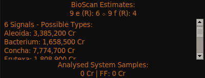
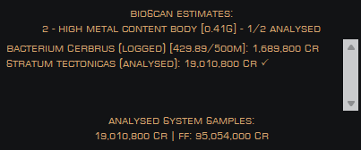

# BioScan plugin for [EDMC]

## BETA
This plugin is a WIP. Feel free to try it, I welcome input about incorrect species requirements and suggestions.

---

BioScan is a utility for Explorers and Exobiologists that attempts to determine the possible value range of biological
signals on bodies. It uses data such as the atmosphere, gravity, volcanism, surface temperature, body type, and local
star type to make the best guess as to what types of flora will be present.

Once done, it will summarize the possible value ranges for all qualifying genera and species.

After you've mapped a planet with biological signals, it will then pare down the list to the detected genera.
And finally, once you've started to scan each species it will display the final type and value of the sample as well as
indicate the scan progress.

Once fully analysed, the total system value (and possible first footfall value) will be shown at the bottom of the pane.

### Navigation

The top of the pane will track all relevant
bodies in the system, including a shorthand for the body type and the number of signals detected there. This can help
you quickly determine a DSS target.

BioScan will track your movements and show just the relevant species data if you are currently located at a body of
interest, to help reduce clutter and scrolling. After you initiate a scan, you will get a display of the required sample
distance and your current minimum distance to a previous sample.

It will reset your scan progress if the previous scan wasn't completed and you start a different genus. It can also
track scans with the composition scanner and will lock in the final species of the genus without requiring
you to scan biologicals one at a time. In this way you can lock in a species and value while competing the analysis of
another lifeform.

### Please Note

EDMC does not parse old system logs so this tool has trouble when revisiting systems. I may use EDSM data to fill in
some holes (if enabled) but it will still be missing signal data. Fortunately, reentering a system does usually trigger
the detailed scan signal data to be logged in the journal again. But not the FSS signal data.

## Requirements
* EDMC version 5 and above

## Installation
* Download the [latest release]
* Extract the `.zip` archive that you downloaded into the EDMC `plugins` folder
  * This is accessible via the plugins tab in the EDMC settings window
* Start or restart EDMC to register the new plugin

## Acknowledgements

Conversion of system coordinates to regions thanks to klightspeed's [EliteDangerousRegionMap].

Species calculations are based on various sources, primarily the 
[Deep Space Network](https://ed-dsn.net/) and the
[Codex NSP and Bio requirements spreadsheet][Bio req spreadsheet].

## Roadmap

* Currently implementing a system to detect the presence of a nebula
* Refinements to species requirements
* ~~Track when near a planet and focus the data view for that planet~~
* ~~Add settings for visibility and display options~~
* Add info about sample distance requirements
* Possibly utilize EDSM data to fill in missing data (revisiting a system)
* ~~Investigate plausibility of getting species from codex scans (Ship / SRV)~~

## License

[BioScan plugin][BioScan] Copyright © 2023 Jeremy Rimpo

Licensed under the [GNU Public License (GPL)][GPLv2] version 2 or later.

[EDMC]: https://github.com/EDCD/EDMarketConnector/wiki
[BioScan]: https://github.com/Silarn/EDMC-BioScan
[latest release]: https://github.com/Silarn/EDMC-BioScan/releases/latest
[GPLv2]: http://www.gnu.org/licenses/gpl-2.0.html
[Bio req spreadsheet]: https://docs.google.com/spreadsheets/d/1nV_UD_0kIxkWAHhAqvf62ILHpbYzdZpJ53CqPHn3qlA/
[EliteDangerousRegionMap]: https://github.com/klightspeed/EliteDangerousRegionMap/
