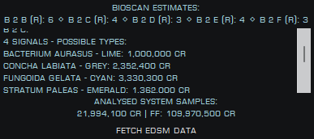
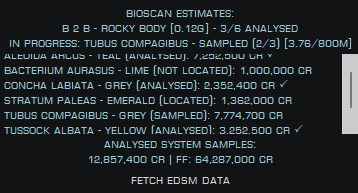
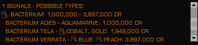

# BioScan

## Summary

BioScan is a multipurpose exobiology tool for Elite Dangerous. It utilizes the plugin system of the [Elite Dangerous
Market Connector][EDMC] for backend journal processing and display.

## Core Functionality and Comparison

The core functionality of BioScan is to provide the best possible estimates for which species will be present on a
planet, much like the [Observatory] [BioInsights] plugin. BioInsights may be slightly more accurate under specific edge
cases, but the results are extremely similar.

There are a few key differences between each. BioScan is intended to be used as an active tool with a compact
interface which could be potentially overlayed onto the game. It also presents key information to help you navigate and
track flora while landing, moving, and scanning on a planet.

It supports both Horizons and Odyssey biologicals.

## Predictions

While collecting scan data of a system, planets with biological signals will be added to the main tracker. Based on the
properties of that planet (as well as your location in the galaxy, and the various stars and body types present), the
scroll pane will display all possible genera and species that could be on that body as well as the potential value range
of those possibilities. You can optionally display a complete breakdown of the possible species and variants.

## Scanning

After you've mapped a planet with biological signals, it will then pare down the list to the detected genera or species.
Once you've started to scan each species, it will display the final type and value of the sample as well as indicate the
scan progress. Additional info will be discussed in the [navigation](#navigation) section below.

Once fully analysed, the total system value (and possible first find value) will be shown at the bottom of the pane.

## Codex Entries

As of version 2.5, any potential species that has not yet been logged to your local region's codex will be marked.

This is marked by the 📝 memo emoji in front of the genus. For best results,
see [journal importing](#journal-importing).

## Navigation

The top of the pane will track all relevant bodies in the system, including a shorthand for the body type and the number
of signals detected there. This can help you quickly determine a DSS target. There are additional indicators for high
gravity `^G^` and extreme gravity `!G!` planets. High gravity is currently considered 1G or greater. Extreme gravity
is 2.7G or greater which makes it impossible to go on foot.

BioScan will track your movements and show just the relevant species data if you are currently located at a body of
interest, to help reduce clutter and scrolling. It will also give you the gravity of the planet to help you gauge your
landing. After you initiate a scan, you will get a display of the required sample distance and your current minimum
distance to a previous sample, which is updated in real time.

It will reset your scan progress if the previous scan wasn't completed and you start a different species. It can also
track scans with the composition scanner and will lock in the final species of the genus without requiring you to scan
biologicals one at a time. In this way you can lock in a species and value while competing the analysis of another
lifeform.

#### Waypoints

Scans with the comp. scanner will log waypoints for any incomplete species. If you have an active scan, the nearest
waypoint for that species will display below the progress indicator. Waypoints within the minimum distance of previous
samples are excluded from the list. When you have no active scan, any remaining unanalyzed species will display the
nearest waypoint in the detailed species list scrollbox.

The waypoint indicator will display the distance to the waypoint, the compass heading toward that waypoint, and an
indicator for the direction and degrees to turn to face that heading. Note that waypoints will log your current
location, so for best results make the scan as close to the target species as possible.

### Persistent Data

As of version 2.0, BioScan now maintains a database of all relevant system data and scan progress. It segments scans and
waypoints by commander, if you play with multiple commanders. You can safely stop and restart EDMC without losing your
data.

The database file is located within EDMC's data storage directory, where the plugins are located. On Windows, this
should be `%LOCALAPPDATA%\EDMarketConnector\bioscan.db`.

### Journal Importing

To facilitate accurate codex entry data, you can import your past journals into the persistent database. Clicking the
button in the bottom left of the settings panel will start the process. This can run in the background while you
continue to use EDMC / BioScan, and the progress will display at the bottom of the BioScan pane.

Despite using a few threads to help speed up the process, parsing several years of journal data can take a good amount
of time. As each journal is completed, it will get logged in the database. This process can be stopped and restarted. It
will pick up at the oldest unprocessed journal, though you will need to click the button in the settings to resume.

### EDSM Integration

Once per system, you can attempt to fetch any data from EDSM. This is helpful in systems that can't be scanned for one
reason or another. Unfortunately, EDSM's API does not currently provide access to biological signal info, so you will
have to manually look up signals if that data was not previously logged.

## Requirements
* [EDMC] version 5.7 and above (python 3.11)
* SQLAlchemy python module (embedded in the exe distribution)

## Installation

### Windows Prebuilt EXE
* Download the [latest release] zip file for Windows
* Extract the `.zip` archive that you downloaded into the EDMC `plugins` folder
  * This is accessible via the plugins tab in the EDMC settings window
* Start or restart EDMC to register the plugin and run any necessary database migrations

### Python Native Execution
* Download and extract the [latest release] zip file for native python into the EDMC `plugins` directory
* Run `pip install -r requirements.txt` within the plugin directory to install SQLAlchemy
  * Ensure the correct `pip` is used for Python 3.11
* Start or restart EDMC to register the plugin and run any necessary database migrations

## Acknowledgements

Conversion of system coordinates to regions thanks to klightspeed's [EliteDangerousRegionMap].

Species calculations are based on various sources, primarily the 
[Deep Space Network] and the
[Codex NSP and Bio requirements spreadsheet][Bio req spreadsheet].

Nebula locations pulled from the [Catalog of Galactic Nebulae] (thanks marx and contributors)

Procedurally generated nebula reference star coordinates pulled from [EDSM]'s API

## Roadmap

* Refinements to species requirements?
* Improve display of codex flag for multiple genus matches
* Expanded settings
* EDMCOverlay support?

## License

[BioScan plugin][BioScan] Copyright © 2023 Jeremy Rimpo

Licensed under the [GNU Public License (GPL)][GPLv2] version 2 or later.

[EDMC]: https://github.com/EDCD/EDMarketConnector/wiki
[EDSM]: https://www.edsm.net/
[Deep Space Network]: https://ed-dsn.net/
[Bio req spreadsheet]: https://docs.google.com/spreadsheets/d/1nV_UD_0kIxkWAHhAqvf62ILHpbYzdZpJ53CqPHn3qlA/
[EliteDangerousRegionMap]: https://github.com/klightspeed/EliteDangerousRegionMap/
[Catalog of Galactic Nebulae]: https://forums.frontier.co.uk/threads/catalogue-of-galactic-nebulae-submit-your-planetary-nebulae.511743/
[BioScan]: https://github.com/Silarn/EDMC-BioScan
[Observatory]: https://github.com/Xjph/ObservatoryCore
[BioInsights]: https://edjp.colacube.net/observatory
[latest release]: https://github.com/Silarn/EDMC-BioScan/releases/latest
[GPLv2]: http://www.gnu.org/licenses/gpl-2.0.html
